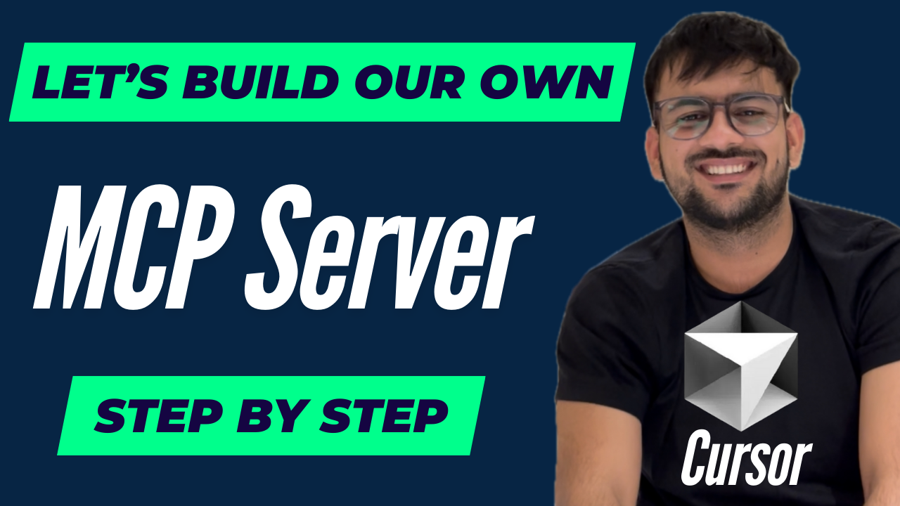

# MCP Agentic RAG



A Machine Conversation Protocol (MCP) implementation that provides RAG (Retrieval Augmented Generation) capabilities using LlamaIndex and Linkup integration.

## Overview

This project demonstrates how to build an MCP server that exposes two main tools:
1. **Web Search**: Uses Linkup to search the web and return results
2. **RAG**: A retrieval-augmented generation system that answers questions based on documents in a local data directory

📺 **[Watch the demo video on YouTube](https://www.youtube.com/watch?v=XMVzT8X0QTA&t=11s)** to see the project in action!

## Requirements

- Python 3.12+
- Ollama (for local LLM inference)
- Linkup API key (for web search capabilities)

## Setup

1. Clone this repository:
```bash
git clone https://github.com/patchy631/mcp-agentic-rag.git
cd mcp-agentic-rag
```

2. Create a virtual environment and install dependencies:
```bash
python -m venv venv
source venv/bin/activate  # On Windows: venv\Scripts\activate
pip install -e .
```

3. Set up Ollama:
   - Install Ollama from [https://ollama.ai/](https://ollama.ai/)
   - Pull the llama3.2 model: `ollama pull llama3.2`

4. Create a `.env` file based on the provided `env.example`:
```bash
cp env.example .env
# Edit .env with your Linkup API key and other settings
```

5. Create a `data` directory and add your documents:
```bash
mkdir -p data
# Add your text, PDF, or other document files to the data directory
```

## Usage

### Running the MCP Server

```bash
python server.py
```

This will start the MCP server using stdio transport, which can be connected to by MCP clients.

### Using as a Python Library

You can also use the RAG workflow directly in your Python code:

```python
import asyncio
from rag import RAGWorkflow

async def main():
    workflow = RAGWorkflow()
    
    # Ingest documents
    await workflow.ingest_documents("path/to/your/documents")
    
    # Query the RAG system
    result = await workflow.query("Your question here")
    
    # Print the response
    async for chunk in result.async_response_gen():
        print(chunk, end="", flush=True)

if __name__ == "__main__":
    asyncio.run(main())
```

## Configuration

You can configure the RAG system by modifying the parameters in the `RAGWorkflow` class:

- `model_name`: The Ollama model to use (default: "llama3.2")
- `embedding_model`: The embedding model to use (default: "BAAI/bge-small-en-v1.5")
- `top_k`: Number of documents to retrieve (default: 2)

## License

MIT
